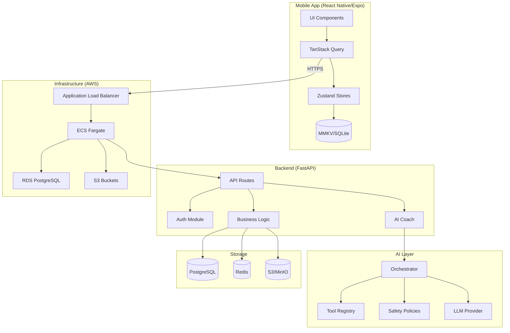

# Sleek Coach

A fitness coaching mobile app with an AI-powered coach that combines daily check-ins, nutrition tracking, and adaptive coaching based on user progress.

[](https://github.com/rlefkowitz/sleek-coach/actions)
[](https://www.python.org/)
[](https://www.typescriptlang.org/)
[](./LICENSE)

## Overview

Sleek Coach helps users achieve their fitness goals through:

- **Daily Check-ins**: Track weight, mood, energy levels, and sleep quality
- **Progress Photos**: Secure photo storage with side-by-side comparisons
- **Nutrition Tracking**: Manual logging or MyFitnessPal CSV import
- **AI Coach**: Personalized guidance using LLM with tool-calling architecture
- **Offline Support**: Full functionality without network, with automatic sync

## Architecture



## Project Structure

```
ultracoach/
├── apps/
│   ├── api/                 # FastAPI backend
│   │   ├── app/
│   │   │   ├── api/v1/      # API routes
│   │   │   ├── auth/        # Authentication
│   │   │   ├── users/       # User management
│   │   │   ├── checkins/    # Check-in logging
│   │   │   ├── nutrition/   # Nutrition tracking
│   │   │   ├── photos/      # Photo management
│   │   │   ├── coach_ai/    # AI coaching system
│   │   │   └── integrations/# External integrations
│   │   ├── tests/           # pytest tests
│   │   └── alembic/         # Database migrations
│   └── mobile/              # React Native (Expo) app
│       ├── src/
│       │   ├── components/  # Reusable UI components
│       │   ├── screens/     # Screen components
│       │   ├── navigation/  # React Navigation setup
│       │   ├── services/    # API clients
│       │   ├── stores/      # Zustand state
│       │   └── hooks/       # Custom hooks
│       └── __tests__/       # Jest tests
├── infra/                   # Terraform infrastructure
│   ├── modules/             # Reusable modules
│   └── environments/        # Staging/production configs
└── docs/                    # Documentation
```

## Tech Stack

| Layer | Technology |
|-------|------------|
| **Mobile** | React Native, Expo, TypeScript, React Navigation |
| **State** | TanStack Query (server), Zustand (client), MMKV |
| **UI** | React Native Paper (Material Design 3) |
| **Backend** | FastAPI, SQLModel, Pydantic, Python 3.12 |
| **Database** | PostgreSQL 15+, Redis |
| **Storage** | AWS S3 (MinIO for local dev) |
| **AI** | OpenAI/Anthropic APIs with tool-calling |
| **Infrastructure** | AWS ECS Fargate, RDS, ALB, Terraform |
| **CI/CD** | GitHub Actions |

## Quick Start

### Prerequisites

- Docker & Docker Compose
- Python 3.12+ (for local backend development)
- Node.js 18+ (for mobile development)
- uv (Python package manager)

### Backend Development

```bash
# Clone the repository
git clone https://github.com/rlefkowitz/sleek-coach.git
cd sleek-coach

# Set up environment variables
cd apps/api
cp .env.example .env
# Edit .env if you need to customize (defaults work out-of-box)

# Start all services with Docker Compose
docker compose up --build

# The API is available at http://localhost:8000
# Swagger docs at http://localhost:8000/docs
# ReDoc at http://localhost:8000/redoc
```

**Local Development (without Docker):**

```bash
cd apps/api

# Install dependencies with uv
uv sync

# Set up environment variables
cp .env.example .env
# Edit .env with your configuration

# Run database migrations
uv run alembic upgrade head

# Start the development server
uv run uvicorn app.main:app --reload --host 0.0.0.0 --port 8000
```

### Mobile Development

This app uses React Native New Architecture and requires a development build (Expo Go is not supported).

```bash
cd apps/mobile

# Set up environment variables
cp .env.example .env
# Edit .env to point to your API server (defaults to localhost:8000)

# Install dependencies
npm install

# Generate native projects (first time only)
npx expo prebuild

# Build and run on iOS simulator (requires Xcode)
npx expo run:ios

# Build and run on Android emulator (requires Android Studio)
npx expo run:android

# After initial build, start the dev server for hot reload
npx expo start --dev-client
```

### Running Tests

**Backend:**

```bash
cd apps/api

# Run all tests
uv run pytest

# Run with coverage
uv run pytest --cov=app --cov-report=html

# Run specific test file
uv run pytest tests/unit/test_auth.py

# Run linting and type checking
uv run ruff check .
uv run mypy .
```

**Mobile:**

```bash
cd apps/mobile

# Run unit tests
npm test

# Run with coverage
npm test -- --coverage

# Run E2E tests (Detox)
npx detox build --configuration ios.sim.debug
npx detox test --configuration ios.sim.debug
```

## Environment Variables

Both the backend and mobile apps use `.env` files for configuration. Template files are provided.

### Backend

Copy the template and customize as needed:

```bash
cd apps/api
cp .env.example .env
```

See `apps/api/.env.example` for all available options. Key variables:

| Variable | Description | Default |
|----------|-------------|---------|
| `DATABASE_URL` | PostgreSQL connection string | Docker: `db:5432`, Local: `localhost:5432` |
| `REDIS_URL` | Redis connection string | Docker: `redis:6379`, Local: `localhost:6379` |
| `OPENAI_API_KEY` | Required for AI coach features | (none) |
| `S3_ENDPOINT_URL` | MinIO/S3 endpoint | Docker: `http://minio:9000` |

### Mobile

Copy the template and customize as needed:

```bash
cd apps/mobile
cp .env.example .env
```

See `apps/mobile/.env.example` for all available options. Key variable:

| Variable | Description | Default |
|----------|-------------|---------|
| `EXPO_PUBLIC_API_URL` | Backend API URL | `http://localhost:8000` |

**Note:** For physical devices, use your computer's IP address instead of `localhost`.

## Development Workflow

1. **Create a feature branch** from `main`
2. **Make changes** following the code style guidelines
3. **Run tests** and ensure they pass
4. **Submit a PR** for review
5. **Merge** after approval

### Code Style

- **Python**: Ruff for linting, Black formatting, mypy for types
- **TypeScript**: ESLint + Prettier, strict mode enabled
- **Commits**: Conventional commits (`feat:`, `fix:`, `docs:`, etc.)

## Deployment

### Staging

Automatic deployment on push to `main` branch via GitHub Actions.

### Production

Manual approval required. See [Infrastructure README](./infra/README.md) for details.

```bash
# Deploy infrastructure
cd infra
terraform init
terraform plan -var-file=environments/production.tfvars
terraform apply -var-file=environments/production.tfvars
```

## Documentation

| Document | Description |
|----------|-------------|
| [Product Requirements (PRD)](docs/PRD.md) | Business goals, user personas, feature scope |
| [Technical Design (TDD)](docs/TDD.md) | Architecture decisions, data flow |
| [API Documentation](docs/API.md) | Complete endpoint reference |
| [Database Schema](docs/DATABASE.md) | ERD, models, migrations |
| [AI Coach System](docs/AI_COACH.md) | Tools, safety policies, prompts |
| [Security](docs/SECURITY.md) | Security architecture, OWASP compliance |
| [Performance](docs/PERFORMANCE.md) | Optimization strategies |
| [Runbook](docs/RUNBOOK.md) | Operations, incidents, rollbacks |
| [Milestones](docs/MILESTONES.md) | Implementation progress |

## API Overview

Base URL: `/api/v1`

| Module | Endpoints | Description |
|--------|-----------|-------------|
| Auth | `/auth/*` | Register, login, token refresh, logout |
| Users | `/me/*` | Profile, goals, preferences, export |
| Check-ins | `/checkins/*` | Weight logging, trends, sync |
| Nutrition | `/nutrition/*` | Daily macros, MFP import |
| Photos | `/photos/*` | Presigned uploads, listing |
| Coach | `/coach/*` | Chat, plans, insights |

See [API Documentation](docs/API.md) for complete reference.

## License

Private - All rights reserved

## Contributing

This is a private project. Contact the maintainer for contribution guidelines.
