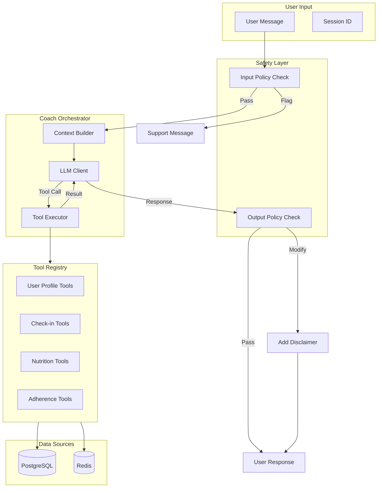

# AI Coach System Documentation

Complete reference for the Sleek Coach AI coaching system.

## Overview

The AI Coach is an LLM-powered conversational assistant that provides personalized fitness and nutrition guidance. It uses a tool-calling architecture to access user data and applies safety policies to ensure responsible recommendations.

---

## Architecture



---

## Component Files

| Component | File | Description |
|-----------|------|-------------|
| Orchestrator | `apps/api/app/coach_ai/orchestrator.py` | Main LLM coordinator |
| Context Builder | `apps/api/app/coach_ai/context_builder.py` | User context preparation |
| Service | `apps/api/app/coach_ai/service.py` | High-level API service |
| Router | `apps/api/app/coach_ai/router.py` | API endpoints |
| Schemas | `apps/api/app/coach_ai/schemas.py` | Request/response models |
| Models | `apps/api/app/coach_ai/models.py` | Database models |

---

## Tool Registry

The AI Coach has access to **6 internal tools** that query user data. Tools are executed automatically when the LLM determines they're needed for answering a question.

### Tool Overview

| Tool | Category | Cache TTL | Description |
|------|----------|-----------|-------------|
| `get_user_profile` | internal | 5 min | User demographics, goals, preferences |
| `get_recent_checkins` | internal | 1 min | Daily check-in data |
| `get_weight_trend` | internal | 5 min | Weight trend analysis |
| `get_nutrition_summary` | internal | 2 min | Nutrition statistics |
| `calculate_tdee` | internal | 10 min | TDEE and macro targets |
| `get_adherence_metrics` | internal | 5 min | Adherence tracking |

---

### Tool Details

#### `get_user_profile`

Retrieves user profile including demographics, goals, and dietary preferences.

**Parameters:** None

**Returns:**
```json
{
  "email": "user@example.com",
  "is_verified": true,
  "profile": {
    "display_name": "John",
    "height_cm": 180.0,
    "sex": "male",
    "birth_year": 1990,
    "activity_level": "moderate",
    "timezone": "America/New_York"
  },
  "goal": {
    "goal_type": "fat_loss",
    "target_weight_kg": 80.0,
    "pace_preference": "moderate",
    "target_date": "2024-06-01"
  },
  "diet_preferences": {
    "diet_type": "none",
    "allergies": ["peanuts"],
    "disliked_foods": ["liver"],
    "meals_per_day": 4,
    "macro_targets": null
  }
}
```

**Use when:** Understanding user's baseline, goals, or dietary restrictions.

---

#### `get_recent_checkins`

Retrieves recent daily check-ins including weight, energy, sleep, and mood data.

**Parameters:**

| Param | Type | Default | Range | Description |
|-------|------|---------|-------|-------------|
| `days` | integer | 14 | 1-90 | Days to look back |

**Returns:**
```json
{
  "checkins": [
    {
      "date": "2024-01-15",
      "weight_kg": 82.5,
      "energy_level": 7,
      "sleep_quality": 8,
      "mood": 7,
      "adherence_score": 0.85,
      "notes": "Feeling good today..."
    }
  ],
  "total": 14,
  "days_requested": 14
}
```

**Use when:** Reviewing recent progress or wellness patterns.

---

#### `get_weight_trend`

Calculates weight trend analysis including 7-day moving average and weekly rate of change.

**Parameters:**

| Param | Type | Default | Range | Description |
|-------|------|---------|-------|-------------|
| `days` | integer | 30 | 7-365 | Days to analyze |

**Returns:**
```json
{
  "weekly_rate_of_change_kg": -0.5,
  "total_change_kg": -2.0,
  "start_weight_kg": 84.5,
  "current_weight_kg": 82.5,
  "data_points": 25,
  "days_analyzed": 30
}
```

**Use when:** Evaluating progress toward weight goals.

---

#### `get_nutrition_summary`

Retrieves aggregated nutrition statistics over a period.

**Parameters:**

| Param | Type | Default | Range | Description |
|-------|------|---------|-------|-------------|
| `days` | integer | 14 | 1-90 | Days to analyze |

**Returns:**
```json
{
  "avg_calories": 2100,
  "avg_protein_g": 145.0,
  "avg_carbs_g": 220.0,
  "avg_fat_g": 70.0,
  "avg_fiber_g": 28.0,
  "days_logged": 12,
  "days_total": 14,
  "logging_rate": 0.857
}
```

**Use when:** Reviewing nutrition patterns or adherence.

---

#### `calculate_tdee`

Calculates TDEE (Total Daily Energy Expenditure) and recommended macro targets.

**Parameters:**

| Param | Type | Default | Description |
|-------|------|---------|-------------|
| `weight_kg` | float | latest check-in | Current weight |

**Returns:**
```json
{
  "bmr": 1825,
  "tdee": 2650,
  "target_calories": 2150,
  "protein_g": 165,
  "carbs_g": 215,
  "fat_g": 72,
  "deficit_surplus": -500
}
```

**Use when:** Setting or adjusting calorie/macro targets.

---

#### `get_adherence_metrics`

Retrieves adherence metrics including check-in rate and nutrition logging rate.

**Parameters:**

| Param | Type | Default | Range | Description |
|-------|------|---------|-------|-------------|
| `days` | integer | 14 | 7-90 | Days to analyze |

**Returns:**
```json
{
  "checkin_rate": 0.92,
  "nutrition_logging_rate": 0.85,
  "current_streak": 7,
  "longest_streak": 14,
  "days_analyzed": 14
}
```

**Use when:** Evaluating user consistency and engagement.

---

## Safety Policies

The AI Coach implements **4 safety policies** that run on both input (user messages) and output (AI responses). Policies are executed in order of severity.

### Policy Execution Order

1. **Eating Disorder Policy** (CRITICAL) - Checked first
2. **Calorie Policy** (BLOCKED)
3. **Weight Loss Policy** (WARNING)
4. **Medical Claims Policy** (BLOCKED)

### Policy Actions

| Action | Behavior |
|--------|----------|
| `ALLOW` | Message passes through unchanged |
| `MODIFY` | Message passes with disclaimer added |
| `BLOCK` | Message rejected, replacement provided |
| `FLAG` | Message rejected with support resources |

---

### Calorie Policy

**File:** `apps/api/app/coach_ai/policies/calorie_policy.py`

**Purpose:** Ensures calorie recommendations are within safe limits.

**Thresholds:**
- Minimum for females: **1,200 calories/day**
- Minimum for males: **1,500 calories/day**
- Maximum deficit: **1,000 calories/day**

**Input Check Patterns:**
```
- "500 calories"
- "under 800 cal"
- "only 600 kcal"
- "less than 1000 calories"
```

**Output Check Patterns:**
```
- "eat around 800"
- "target of 1000"
- "aim for 900"
```

**Response (MODIFY):**
> I understand you're motivated, but calorie levels below [1200/1500] aren't recommended for health and safety reasons. Let me help you find a sustainable approach that will get you results safely.

---

### Eating Disorder Policy

**File:** `apps/api/app/coach_ai/policies/eating_disorder_policy.py`

**Purpose:** Detects eating disorder signals and provides supportive resources.

**Severity:** CRITICAL

**Trigger Keywords:**
```
purge, purging, binge, binging, laxative, laxatives,
diet pills, water fast, juice cleanse, body checking,
thinspo, pro-ana, pro-mia, meanspo, bonespo
```

**Trigger Phrases:**
```
- "how to not eat"
- "punish myself with eating"
- "hate my body"
- "never eat again"
- "scared to eat"
- "make myself throw up"
- "starving myself"
```

**Output Blocked Patterns:**
```
- "skip all meals"
- "very low calorie"
- "extreme diet"
- "fast for X days"
- "don't eat until"
- "restrict heavily"
```

**Response (FLAG):**
> I notice you may be going through a difficult time with food and body image. Your wellbeing is what matters most...
>
> **National Eating Disorders Association (NEDA):** 1-800-931-2237
> **Crisis Text Line:** Text 'NEDA' to 741741

---

### Weight Loss Policy

**File:** `apps/api/app/coach_ai/policies/weight_loss_policy.py`

**Purpose:** Ensures weight loss recommendations don't exceed safe rates.

**Threshold:** Maximum **1% of body weight per week**

**Input Check Patterns:**
```
- "lose 10 lbs per week"
- "drop 5kg fast"
- "5 pounds a week"
```

**Output Check Patterns:**
```
- "lose 2kg weekly"
- "expect to drop 5 lbs"
- "3 lbs per week"
```

**Response (MODIFY):**
> A safe and sustainable rate of weight loss is typically 0.5-1% of body weight per week. Faster rates can lead to muscle loss, metabolic slowdown, and are difficult to maintain.

---

### Medical Claims Policy

**File:** `apps/api/app/coach_ai/policies/medical_claims_policy.py`

**Purpose:** Prevents medical diagnoses and redirects to healthcare providers.

**Medical Keywords:**
```
diagnose, diagnosis, prescribe, prescription, medication,
medicine, disease, disorder, syndrome, treatment, cure
```

**Medical Conditions:**
```
diabetes, thyroid, hormone, PCOS, insulin resistance,
heart disease, hypertension, kidney disease, liver disease,
cancer, pregnancy, breastfeeding
```

**Response (BLOCK):**
> I'm not able to provide medical diagnoses or treatment recommendations. For questions about [condition], please consult with:
> - Your primary care physician
> - A registered dietitian
> - An endocrinologist (for hormonal issues)
> - A mental health professional (for behavioral concerns)

---

## System Prompts

### Coach Prompt

Used for general chat interactions.

**Personality:**
- Encouraging and positive, but realistic
- Data-driven and evidence-based
- Supportive without being preachy
- Direct and actionable

**Guidelines:**
1. Always use tools to get current data before advice
2. Be specific - reference actual numbers
3. Explain reasoning - show what data informed advice
4. Personalize - use name and reference specific goals
5. Be encouraging - celebrate progress and wins
6. Be realistic - acknowledge struggles supportively

**Safety Rules (Embedded):**
- Never recommend <1200/1500 cal without supervision
- Never recommend >1% weight loss/week
- Always recommend healthcare for medical questions
- Provide resources for disordered eating signals
- Don't make medical diagnoses

### Insights Prompt

Used for generating weekly insights.

**Format:**
```
Type: trend | achievement | recommendation | warning
Title: Short headline (5-10 words)
Description: 1-2 sentences with specific data
Action: What they should do next
```

### Plan Prompt

Used for weekly plan generation.

**Includes:**
- Daily calorie and macro targets
- 2-3 focus areas for the week
- 3-5 specific, actionable recommendations

---

## Extending the System

### Adding a New Tool

1. Create tool class in `apps/api/app/coach_ai/tools/`:

```python
from app.coach_ai.tools.base import BaseTool, ToolResult

class MyNewTool(BaseTool):
    name = "my_new_tool"
    description = "Description for the LLM to understand when to use this"
    category = "internal"  # or "external"
    requires_consent = False  # True for external tools
    cacheable = True
    cache_ttl_seconds = 300

    def get_parameters_schema(self) -> dict:
        return {
            "type": "object",
            "properties": {
                "param1": {
                    "type": "string",
                    "description": "Parameter description"
                }
            },
            "required": ["param1"]
        }

    async def execute(self, user_id: str, **kwargs) -> ToolResult:
        # Implementation
        return ToolResult(success=True, data={"result": "..."})
```

2. Register in `apps/api/app/coach_ai/tools/registry.py`:

```python
from app.coach_ai.tools.my_tools import MyNewTool

def create_tool_registry(session: AsyncSession) -> ToolRegistry:
    registry = ToolRegistry()
    # ... existing tools
    registry.register(MyNewTool(session))
    return registry
```

### Adding a New Policy

1. Create policy class in `apps/api/app/coach_ai/policies/`:

```python
from app.coach_ai.policies.base import (
    BasePolicy, PolicyAction, PolicyResult, PolicySeverity, UserContext
)

class MyNewPolicy(BasePolicy):
    name = "my_new_policy"
    description = "What this policy checks for"
    severity = PolicySeverity.WARNING  # or BLOCKED, CRITICAL

    def check_input(self, user_input: str, context: UserContext) -> PolicyResult:
        # Check user message
        if dangerous_pattern_detected:
            return PolicyResult(
                passed=False,
                action=PolicyAction.MODIFY,
                severity=self.severity,
                violation_type="my_violation_type",
                message="User-facing message"
            )
        return PolicyResult(passed=True, action=PolicyAction.ALLOW)

    def check_output(self, llm_output: str, context: UserContext) -> PolicyResult:
        # Check AI response
        return PolicyResult(passed=True, action=PolicyAction.ALLOW)
```

2. Register in `apps/api/app/coach_ai/policies/engine.py`:

```python
from app.coach_ai.policies.my_policy import MyNewPolicy

class SafetyPolicyEngine:
    def __init__(self):
        self.policies = [
            EatingDisorderPolicy(),
            CaloriePolicy(),
            WeightLossPolicy(),
            MedicalClaimsPolicy(),
            MyNewPolicy(),  # Add new policy
        ]
```

---

## Monitoring & Logging

### Tool Call Logging

Every tool execution is logged to `ai_tool_call_log`:
- Tool name and category
- Input hash and summary
- Output summary
- Execution latency
- Cache hit/miss status

### Policy Violation Logging

Every policy violation is logged to `ai_policy_violation_log`:
- Violation type and severity
- Trigger content (sanitized)
- Action taken
- Session context

### Useful Queries

**Most used tools:**
```sql
SELECT tool_name, COUNT(*) as calls, AVG(latency_ms) as avg_latency
FROM ai_tool_call_log
WHERE created_at > NOW() - INTERVAL '7 days'
GROUP BY tool_name
ORDER BY calls DESC;
```

**Policy violations by type:**
```sql
SELECT violation_type, severity, COUNT(*) as count
FROM ai_policy_violation_log
WHERE created_at > NOW() - INTERVAL '30 days'
GROUP BY violation_type, severity
ORDER BY count DESC;
```

**Cache hit rate:**
```sql
SELECT
    tool_name,
    SUM(CASE WHEN cached THEN 1 ELSE 0 END)::float / COUNT(*) as cache_hit_rate
FROM ai_tool_call_log
WHERE created_at > NOW() - INTERVAL '7 days'
GROUP BY tool_name;
```

---

## Best Practices

### For Users

1. **Be specific** - The more context you provide, the better advice you'll get
2. **Log consistently** - More data = better personalized recommendations
3. **Ask follow-up questions** - The coach remembers conversation context

### For Developers

1. **Keep tools focused** - Each tool should do one thing well
2. **Cache appropriately** - Balance freshness vs. performance
3. **Log everything** - Debugging AI systems requires good observability
4. **Test edge cases** - Especially around safety policy boundaries
5. **Monitor violations** - Track policy triggers to identify patterns
