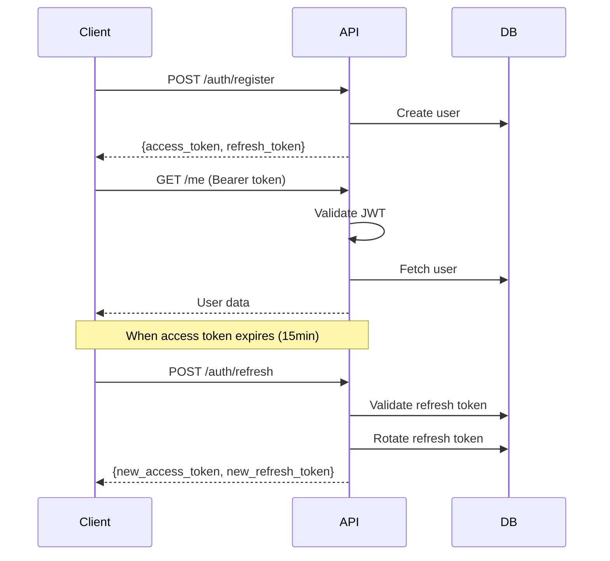

# API Documentation

Complete reference for the Sleek Coach REST API.

## Overview

- **Base URL**: `/api/v1`
- **Authentication**: JWT Bearer tokens
- **Content-Type**: `application/json`
- **Documentation**: Swagger UI at `/docs`, ReDoc at `/redoc`

## Authentication Flow



### Token Lifecycle

| Token Type | Expiry | Usage |
|------------|--------|-------|
| Access Token | 15 minutes | Authorization header for API requests |
| Refresh Token | 7 days | Obtain new access token |

### Using Tokens

Include the access token in the `Authorization` header:

```bash
curl -H "Authorization: Bearer <access_token>" \
  https://api.sleekcoach.com/api/v1/me
```

---

## Error Handling

### Standard Error Response

```json
{
  "detail": "Error message describing what went wrong"
}
```

### HTTP Status Codes

| Code | Description |
|------|-------------|
| `200` | Success |
| `201` | Created |
| `204` | No Content (successful deletion) |
| `400` | Bad Request - Invalid input |
| `401` | Unauthorized - Invalid/missing token |
| `403` | Forbidden - Insufficient permissions |
| `404` | Not Found |
| `422` | Validation Error |
| `429` | Rate Limited |
| `500` | Internal Server Error |

### Validation Error Format

```json
{
  "detail": [
    {
      "loc": ["body", "email"],
      "msg": "Invalid email format",
      "type": "value_error"
    }
  ]
}
```

---

## Rate Limiting

| Endpoint | Limit |
|----------|-------|
| `POST /auth/login` | 5 requests per 15 minutes per IP |
| `POST /auth/register` | 3 requests per hour per IP |
| All other endpoints | 100 requests per minute per user |

---

## Endpoints

### Authentication

#### Register New User

```http
POST /api/v1/auth/register
```

Creates a new user account with email and password.

**Request Body:**

```json
{
  "email": "user@example.com",
  "password": "SecurePassword123!"
}
```

**Password Requirements:**
- Minimum 8 characters
- At least one uppercase letter
- At least one lowercase letter
- At least one number

**Response (201):**

```json
{
  "access_token": "eyJ0eXAiOiJKV1QiLCJhbGciOiJIUzI1NiJ9...",
  "refresh_token": "eyJ0eXAiOiJKV1QiLCJhbGciOiJIUzI1NiJ9...",
  "token_type": "bearer",
  "expires_in": 900
}
```

**curl Example:**

```bash
curl -X POST https://api.sleekcoach.com/api/v1/auth/register \
  -H "Content-Type: application/json" \
  -d '{"email": "user@example.com", "password": "SecurePassword123!"}'
```

---

#### Login

```http
POST /api/v1/auth/login
```

Authenticate with email and password.

**Request Body:**

```json
{
  "email": "user@example.com",
  "password": "SecurePassword123!"
}
```

**Response (200):**

```json
{
  "access_token": "eyJ0eXAiOiJKV1QiLCJhbGciOiJIUzI1NiJ9...",
  "refresh_token": "eyJ0eXAiOiJKV1QiLCJhbGciOiJIUzI1NiJ9...",
  "token_type": "bearer",
  "expires_in": 900
}
```

---

#### Refresh Tokens

```http
POST /api/v1/auth/refresh
```

Exchange refresh token for new token pair. Implements token rotation.

**Request Body:**

```json
{
  "refresh_token": "eyJ0eXAiOiJKV1QiLCJhbGciOiJIUzI1NiJ9..."
}
```

**Response (200):**

```json
{
  "access_token": "eyJ0eXAiOiJKV1QiLCJhbGciOiJIUzI1NiJ9...",
  "refresh_token": "eyJ0eXAiOiJKV1QiLCJhbGciOiJIUzI1NiJ9...",
  "token_type": "bearer",
  "expires_in": 900
}
```

---

#### Logout

```http
POST /api/v1/auth/logout
```

Invalidate the provided refresh token.

**Request Body:**

```json
{
  "refresh_token": "eyJ0eXAiOiJKV1QiLCJhbGciOiJIUzI1NiJ9..."
}
```

**Response (200):**

```json
{
  "message": "Successfully logged out"
}
```

---

#### Logout All Devices

```http
POST /api/v1/auth/logout-all
```

**Requires Authentication**

Invalidate all refresh tokens for the current user.

**Response (200):**

```json
{
  "message": "Logged out from 3 sessions"
}
```

---

#### Change Password

```http
POST /api/v1/auth/change-password
```

**Requires Authentication**

Change the current user's password.

**Request Body:**

```json
{
  "current_password": "OldPassword123!",
  "new_password": "NewSecurePassword456!"
}
```

**Response (200):**

```json
{
  "message": "Password changed successfully"
}
```

---

### Users

#### Get Current User

```http
GET /api/v1/me
```

**Requires Authentication**

Returns the authenticated user with profile, goals, and preferences.

**Response (200):**

```json
{
  "id": "550e8400-e29b-41d4-a716-446655440000",
  "email": "user@example.com",
  "is_active": true,
  "is_verified": false,
  "created_at": "2024-01-15T10:30:00Z",
  "profile": {
    "display_name": "John",
    "height_cm": 180,
    "sex": "male",
    "birth_year": 1990,
    "activity_level": "moderate",
    "timezone": "America/New_York"
  },
  "goal": {
    "goal_type": "fat_loss",
    "target_weight_kg": 80.0,
    "pace_preference": "moderate",
    "target_date": "2024-06-01"
  },
  "preferences": {
    "diet_type": "none",
    "allergies": ["peanuts"],
    "disliked_foods": ["liver"],
    "meals_per_day": 4,
    "macro_targets": null
  }
}
```

---

#### Update Profile

```http
PATCH /api/v1/me/profile
```

**Requires Authentication**

Update profile fields (partial update supported).

**Request Body:**

```json
{
  "display_name": "John Doe",
  "height_cm": 182,
  "activity_level": "active"
}
```

**Fields:**

| Field | Type | Constraints |
|-------|------|-------------|
| `display_name` | string | Max 100 characters |
| `height_cm` | integer | 50-300 |
| `sex` | enum | `male`, `female`, `other`, `prefer_not_to_say` |
| `birth_year` | integer | 1900-2100 |
| `activity_level` | enum | `sedentary`, `light`, `moderate`, `active`, `very_active` |
| `timezone` | string | Valid timezone (e.g., `America/New_York`) |

**Response (200):**

```json
{
  "display_name": "John Doe",
  "height_cm": 182,
  "sex": "male",
  "birth_year": 1990,
  "activity_level": "active",
  "timezone": "America/New_York"
}
```

---

#### Update Goals

```http
PATCH /api/v1/me/goals
```

**Requires Authentication**

Update fitness goals.

**Request Body:**

```json
{
  "goal_type": "muscle_gain",
  "target_weight_kg": 85.0,
  "pace_preference": "slow"
}
```

**Fields:**

| Field | Type | Constraints |
|-------|------|-------------|
| `goal_type` | enum | `fat_loss`, `muscle_gain`, `recomp`, `maintenance`, `performance` |
| `target_weight_kg` | float | 20-500, nullable |
| `pace_preference` | enum | `slow`, `moderate`, `aggressive` |
| `target_date` | date | ISO format, nullable |

---

#### Update Diet Preferences

```http
PATCH /api/v1/me/preferences
```

**Requires Authentication**

Update dietary preferences.

**Request Body:**

```json
{
  "diet_type": "vegetarian",
  "allergies": ["dairy", "gluten"],
  "meals_per_day": 5
}
```

**Fields:**

| Field | Type | Constraints |
|-------|------|-------------|
| `diet_type` | enum | `none`, `vegetarian`, `vegan`, `pescatarian`, `keto`, `paleo`, `halal`, `kosher` |
| `allergies` | array | List of strings |
| `disliked_foods` | array | List of strings |
| `meals_per_day` | integer | 1-10 |
| `macro_targets` | object | Custom macro targets, nullable |

---

#### Export User Data

```http
GET /api/v1/me/export
```

**Requires Authentication**

Export all user data for GDPR compliance.

**Response (200):**

```json
{
  "user": { ... },
  "check_ins": [ ... ],
  "nutrition_days": [ ... ],
  "photo_count": 12,
  "exported_at": "2024-01-15T12:00:00Z"
}
```

---

#### Delete Account

```http
DELETE /api/v1/me
```

**Requires Authentication**

Permanently delete account and all associated data.

**Response (200):**

```json
{
  "message": "Account deleted successfully"
}
```

---

### Check-ins

#### Create/Update Check-in

```http
POST /api/v1/checkins
```

**Requires Authentication**

Create or update a check-in (upsert by date).

**Request Body:**

```json
{
  "date": "2024-01-15",
  "weight_kg": 82.5,
  "notes": "Feeling good today",
  "energy_level": 8,
  "sleep_quality": 7,
  "mood": 8
}
```

**Fields:**

| Field | Type | Constraints |
|-------|------|-------------|
| `date` | date | Required, not in future |
| `weight_kg` | float | 20-500, nullable |
| `notes` | string | Nullable |
| `energy_level` | integer | 1-10, nullable |
| `sleep_quality` | integer | 1-10, nullable |
| `mood` | integer | 1-10, nullable |

**Response (201):**

```json
{
  "id": "550e8400-e29b-41d4-a716-446655440001",
  "date": "2024-01-15",
  "weight_kg": 82.5,
  "notes": "Feeling good today",
  "energy_level": 8,
  "sleep_quality": 7,
  "mood": 8,
  "adherence_score": null,
  "created_at": "2024-01-15T08:30:00Z",
  "updated_at": "2024-01-15T08:30:00Z"
}
```

---

#### List Check-ins

```http
GET /api/v1/checkins
```

**Requires Authentication**

**Query Parameters:**

| Param | Type | Default | Description |
|-------|------|---------|-------------|
| `from` | date | 30 days ago | Start date |
| `to` | date | today | End date |
| `limit` | integer | 100 | Max 500 |
| `offset` | integer | 0 | Pagination offset |

**Example:**

```bash
curl -H "Authorization: Bearer <token>" \
  "https://api.sleekcoach.com/api/v1/checkins?from=2024-01-01&to=2024-01-31"
```

**Response (200):**

```json
{
  "items": [
    {
      "id": "...",
      "date": "2024-01-15",
      "weight_kg": 82.5,
      ...
    }
  ],
  "total": 15,
  "limit": 100,
  "offset": 0
}
```

---

#### Get Latest Check-in

```http
GET /api/v1/checkins/latest
```

**Requires Authentication**

Returns the most recent check-in or `null` if none exist.

---

#### Get Weight Trends

```http
GET /api/v1/checkins/trends
```

**Requires Authentication**

**Query Parameters:**

| Param | Type | Default | Constraints |
|-------|------|---------|-------------|
| `days` | integer | 30 | 7-365 |

**Response (200):**

```json
{
  "period_days": 30,
  "data_points": 25,
  "start_weight": 85.0,
  "end_weight": 82.5,
  "total_change": -2.5,
  "weekly_rate": -0.58,
  "moving_average": [
    {"date": "2024-01-08", "value": 84.2},
    {"date": "2024-01-09", "value": 83.9},
    ...
  ],
  "trend_direction": "down"
}
```

---

#### Sync Check-ins (Offline Support)

```http
POST /api/v1/checkins/sync
```

**Requires Authentication**

Sync batch of check-ins with conflict resolution.

**Request Body:**

```json
{
  "checkins": [
    {
      "date": "2024-01-14",
      "weight_kg": 83.0,
      "client_updated_at": "2024-01-14T09:00:00Z"
    },
    {
      "date": "2024-01-15",
      "weight_kg": 82.5,
      "client_updated_at": "2024-01-15T08:30:00Z"
    }
  ]
}
```

**Response (200):**

```json
{
  "results": [
    {"date": "2024-01-14", "status": "created", "server_version": {...}},
    {"date": "2024-01-15", "status": "conflict", "server_version": {...}}
  ],
  "conflicts": 1
}
```

---

### Nutrition

#### Create/Update Nutrition Day

```http
POST /api/v1/nutrition/day
```

**Requires Authentication**

**Request Body:**

```json
{
  "date": "2024-01-15",
  "calories": 2100,
  "protein_g": 150,
  "carbs_g": 220,
  "fat_g": 70,
  "fiber_g": 30,
  "source": "manual"
}
```

**Response (201):**

```json
{
  "id": "550e8400-e29b-41d4-a716-446655440002",
  "date": "2024-01-15",
  "calories": 2100,
  "protein_g": 150.0,
  "carbs_g": 220.0,
  "fat_g": 70.0,
  "fiber_g": 30.0,
  "source": "manual",
  "created_at": "2024-01-15T20:00:00Z"
}
```

---

#### Get Nutrition Day

```http
GET /api/v1/nutrition/day?date=2024-01-15
```

**Requires Authentication**

Returns nutrition for specific date or `null` if not logged.

---

#### Get Nutrition Range

```http
GET /api/v1/nutrition/range?from=2024-01-01&to=2024-01-31
```

**Requires Authentication**

**Query Parameters:**

| Param | Type | Description |
|-------|------|-------------|
| `from` | date | Start date (required) |
| `to` | date | End date (required) |
| `aggregate` | boolean | Return aggregate stats instead of daily data |

**Response without aggregate (200):**

```json
{
  "items": [...],
  "total": 31,
  "from_date": "2024-01-01",
  "to_date": "2024-01-31"
}
```

**Response with aggregate=true (200):**

```json
{
  "from_date": "2024-01-01",
  "to_date": "2024-01-31",
  "total_days": 31,
  "logged_days": 28,
  "avg_calories": 2150.5,
  "avg_protein_g": 148.2,
  "avg_carbs_g": 225.0,
  "avg_fat_g": 68.5,
  "avg_fiber_g": 28.3,
  "total_calories": 60214
}
```

---

#### Delete Nutrition Day

```http
DELETE /api/v1/nutrition/day?date=2024-01-15
```

**Requires Authentication**

**Response (204):** No content

---

#### Calculate Macro Targets

```http
POST /api/v1/nutrition/calculate-targets
```

**Requires Authentication**

Calculate TDEE and macro targets using Mifflin-St Jeor formula.

**Request Body:**

```json
{
  "weight_kg": 82.5,
  "height_cm": 180,
  "age": 34,
  "sex": "male",
  "activity_level": "moderate",
  "goal_type": "fat_loss",
  "pace": "moderate"
}
```

**Response (200):**

```json
{
  "tdee": 2650,
  "bmr": 1825,
  "target_calories": 2150,
  "protein_g": 165,
  "carbs_g": 215,
  "fat_g": 72,
  "deficit_surplus": -500,
  "warnings": []
}
```

---

### Photos

#### Generate Presigned Upload URL

```http
POST /api/v1/photos/presign
```

**Requires Authentication**

**Request Body:**

```json
{
  "filename": "progress_front.jpg",
  "content_type": "image/jpeg"
}
```

**Response (200):**

```json
{
  "photo_id": "550e8400-e29b-41d4-a716-446655440003",
  "upload_url": "https://s3.amazonaws.com/bucket/...",
  "s3_key": "users/550e8400.../photos/550e8400...",
  "expires_in": 300
}
```

---

#### Commit Photo

```http
POST /api/v1/photos/commit
```

**Requires Authentication**

Call after successfully uploading to the presigned URL.

**Request Body:**

```json
{
  "photo_id": "550e8400-e29b-41d4-a716-446655440003",
  "s3_key": "users/550e8400.../photos/550e8400...",
  "date": "2024-01-15",
  "visibility": "private",
  "metadata": {
    "width": 1080,
    "height": 1920
  }
}
```

**Response (201):**

```json
{
  "id": "550e8400-e29b-41d4-a716-446655440003",
  "date": "2024-01-15",
  "visibility": "private",
  "download_url": "https://s3.amazonaws.com/bucket/...",
  "metadata": {"width": 1080, "height": 1920},
  "created_at": "2024-01-15T10:00:00Z"
}
```

---

#### List Photos

```http
GET /api/v1/photos?from=2024-01-01&to=2024-01-31
```

**Requires Authentication**

Returns photos with presigned download URLs.

---

#### Get Photo

```http
GET /api/v1/photos/{photo_id}
```

**Requires Authentication**

---

#### Delete Photo

```http
DELETE /api/v1/photos/{photo_id}
```

**Requires Authentication**

**Response (200):**

```json
{
  "message": "Photo deleted successfully"
}
```

---

### AI Coach

#### Chat with Coach

```http
POST /api/v1/coach/chat
```

**Requires Authentication**

**Request Body:**

```json
{
  "message": "How am I progressing this week?",
  "session_id": "optional-session-uuid"
}
```

**Response (200):**

```json
{
  "message": "Based on your check-ins this week, you're making great progress! You've lost 0.5kg, which is right on track with your moderate pace goal...",
  "session_id": "550e8400-e29b-41d4-a716-446655440004",
  "tool_trace": [
    {
      "tool": "get_recent_checkins",
      "purpose": "Retrieved last 7 days of check-in data",
      "latency_ms": 45
    },
    {
      "tool": "get_weight_trend",
      "purpose": "Calculated weight trend over 14 days",
      "latency_ms": 32
    }
  ],
  "confidence": 0.85,
  "data_gaps": ["No nutrition logged for Tuesday"],
  "disclaimers": [],
  "tokens_used": 1250
}
```

---

#### Stream Chat Response

```http
POST /api/v1/coach/chat/stream
```

**Requires Authentication**

Returns Server-Sent Events (SSE).

**Event Types:**

```
data: {"type": "token", "data": "Based on "}
data: {"type": "token", "data": "your check-ins..."}
data: {"type": "tool_start", "data": {"tool": "get_recent_checkins"}}
data: {"type": "tool_end", "data": {"tool": "get_recent_checkins", "latency_ms": 45}}
data: {"type": "done", "data": {"status": "complete"}}
```

---

#### Generate Weekly Plan

```http
POST /api/v1/coach/plan
```

**Requires Authentication**

**Request Body:**

```json
{
  "start_date": "2024-01-15",
  "preferences": {
    "focus_areas": ["protein", "consistency"]
  }
}
```

**Response (200):**

```json
{
  "week_of": "2024-01-15",
  "daily_targets": {
    "calories": 2150,
    "protein_g": 165,
    "carbs_g": 215,
    "fat_g": 72
  },
  "focus_areas": [
    "Hit protein target daily",
    "Maintain check-in consistency"
  ],
  "recommendations": [
    "Add a protein shake post-workout",
    "Prep meals on Sunday for the week",
    "Weigh in at the same time each day"
  ],
  "created_at": "2024-01-15T06:00:00Z"
}
```

---

#### Get Weekly Insights

```http
GET /api/v1/coach/insights
```

**Requires Authentication**

**Response (200):**

```json
{
  "insights": [
    {
      "type": "trend",
      "title": "Weight Trend",
      "description": "You've lost 0.8kg this week, slightly faster than target",
      "action": "Consider increasing calories by 100"
    },
    {
      "type": "achievement",
      "title": "Check-in Streak",
      "description": "7-day check-in streak! Great consistency.",
      "action": null
    },
    {
      "type": "recommendation",
      "title": "Protein Intake",
      "description": "Average protein is 15g below target",
      "action": "Add Greek yogurt as a snack"
    }
  ],
  "generated_at": "2024-01-15T06:00:00Z"
}
```

---

## Webhooks

*Coming soon*

---

## SDK & Libraries

*Coming soon*

---

## Changelog

| Version | Date | Changes |
|---------|------|---------|
| 1.0.0 | 2024-01 | Initial API release |
